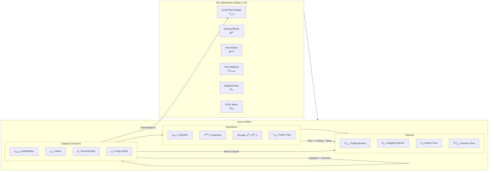
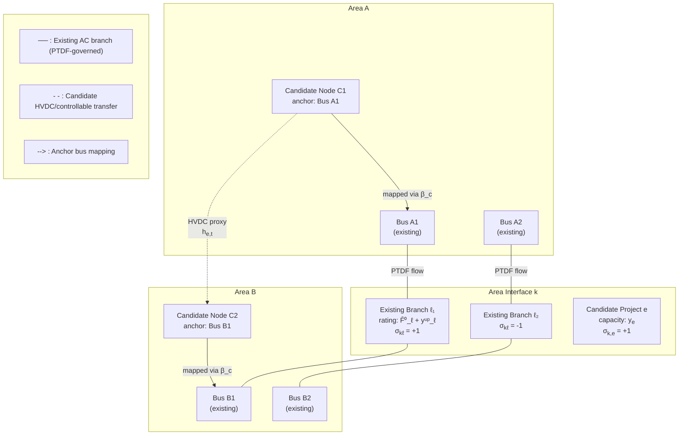

# General Zonal-to-Nodal Capacity Allocation and Transmission Realization Formulation

## Purpose and Modeling Scope

Capacity-expansion models (CEMs) operate on aggregated zones, producing fleet targets $T_{a,i,d}$ that specify how much capacity of each technology belongs in each area. This formulation solves the downstream problem: given those zonal targets, determine where to site each megawatt on the actual transmission network, which existing units to retire, and whether transmission upgrades are needed to make the resulting fleet physically feasible.

The formulation bridges two modeling resolutions:

- *From zones to nodes.* A zonal target $T_{a,i,d}$ is a scalar; the nodal allocation $x_{m,b,d}$ places capacity at specific buses $b$ within area $a$.
- *From capacity to power flow.* Building capacity at a bus changes injections, which change branch flows via the PTDF matrix. The formulation checks whether the network can accommodate the fleet.

It supports:

| Capability | Domain |
|-----------|--------|
| Existing generators with retirement or retention decisions | Fleet |
| New supply-curve capacity blocks | Fleet |
| Fixed or bounded investment blocks without supply-curve data | Fleet |
| Storage technologies with power (MW) and energy (MWh) capacity | Fleet |
| Disabled, inactive, unavailable, and must-keep generator status logic | Fleet |
| Bus-voltage and interconnection-headroom preferences | Siting |
| PTDF-based branch-flow feasibility | Network |
| Area-interchange expansion from a zonal capacity-expansion model | Transmission |
| Optional realization of area-interchange expansion through candidate nodal terminal nodes and candidate transmission projects | Transmission |

### Modeling Assumptions

1. *Final fleet target.* The zonal capacity target is the final resulting fleet. It already includes interconnection-queue projects. Queue projects are not a separate set. If queue projects exist as nodal records, include them in the existing-resource set with appropriate status bounds (e.g., non-retireable or high-retention priority).

2. *LP core.* The core optimization is a linear program (LP) if all capacity, retirement, dispatch, storage, transmission, and slack variables are continuous. Exact generator-count sizing, exact unit-retirement commitment, exact bus-use commitment, or exact no-simultaneous-storage-charge/discharge logic requires integer variables or complementarity and is outside the pure LP core.

3. *Electrical-engineering rule.*

   > Area-interchange expansion is not automatically a physical nodal branch.

   A capacity-expansion model may decide that interface $k$ between areas needs $\Delta H^{\text{CEM}}_k$ MW of additional transfer capability. This is a scalar decision: the CEM does not specify which wires carry the new flow, nor where they connect. The nodal model must decide how (or whether) to realize this expansion physically.

   There are three realization paths:
   - (a) an aggregate interface constraint only (no physical wires, just raise the limit);
   - (b) a mapped rating uprate on existing branches or corridors (increase thermal rating of wires already in the PTDF matrix);
   - (c) a candidate controllable transfer or HVDC-like project with known terminals (add a controllable source-sink pair without changing the AC topology).

   A true new AC branch is different. An AC branch adds a new row and column to the network admittance matrix $Y_{\text{bus}}$. Since the PTDF matrix $\Phi$ is derived from $Y_{\text{bus}}$ via $\Phi = B_f B_{\text{bus}}^{-1}$ (where $B_f$ is the branch susceptance matrix and $B_{\text{bus}}$ is the bus susceptance matrix), changing $Y_{\text{bus}}$ changes every element of $\Phi$. A fixed-PTDF LP cannot capture this. The correct procedure is: solve the LP with candidate controllable projects, then rebuild the topology externally with the selected AC branches, recompute $\Phi$, and rerun.

---

## Overall Architecture

```mermaid
flowchart TD
    subgraph PreOptimization["Pre-Optimization Workflow"]
        S1["Step 1: Normalize Zonal Fleet Targets"] --> S2
        S2["Step 2: Build Existing-Resource Block Table"] --> S3
        S3["Step 3: Build New Capacity Blocks"] --> S4
        S4["Step 4: Create Technology-Mapping Coefficients"] --> S5
        S5["Step 5: Generate Eligible Bus Sets"] --> S6
        S6["Step 6: Create Candidate Terminal Nodes"] --> S7
        S7["Step 7: Create Candidate Transmission Projects"] --> S8
        S8["Step 8: Map Existing Branches to Area Interfaces"] --> S9
        S9["Step 9: Interpret Area-Interchange Expansion"] --> S10
        S10["Step 10: Prepare PTDF and Base-Case Data"] --> S11
        S11["Step 11: Select Operating Scenarios"] --> S12
        S12["Step 12: Select Objective Priority Method"]
    end

    S12 --> ModelTypes{Optimization Mode}

    ModelTypes -->|Single LP| SingleLP["Single Weighted LP"]
    ModelTypes -->|Lexicographic| Lexico["6-Stage Lexicographic LP Sequence"]

    SingleLP --> Solve
    Lexico --> Solve

    subgraph Solve["Optimization Model"]
        direction TB
        Sets["Sets: Areas, Technologies, Buses, Branches, Interfaces, Blocks"]
        Params["Parameters: Costs, Capacities, PTDFs, Headrooms"]
        Vars["Decision Variables: Capacity, Dispatch, Storage, Transmission"]
        Obj["Objective Function: Min Cost + Penalties"]
        Con["Constraints: Fleet, Network, Storage, Headroom"]

        Sets --> Params --> Vars --> Obj --> Con
    end

    Solve --> PostOpt["Post-Optimization Validation"]
    PostOpt --> Iterate{Need AC branch expansion?}
    Iterate -->|Yes| Rebuild["Rebuild topology, recompute PTDF, rerun"]
    Iterate -->|No| Done["Final Allocation Validated"]
```



---

## Pre-Optimization Workflow

The optimization should be preceded by a deterministic model-compilation workflow of 12 steps.

### Step 1: Normalize Zonal Fleet Targets

Collect the final zonal capacity targets:

```math
T_{a,i,d}
```

Where:

| Symbol | Meaning |
|--------|---------|
| $a$ | Area |
| $i$ | Technology |
| $d$ | Capacity dimension |

*Capacity dimensions by technology type:*

```math
 \mathcal{D}_i = \begin{cases} \{P\}, & \text{non-storage} \\ \{P, E\}, & \text{storage} \end{cases} 
```

- $P$ = MW (power capacity)
- $E$ = MWh (energy capacity)

> [!IMPORTANT]
> If the zonal model gives only storage MW, then no storage-energy target should be imposed. Storage MWh should instead be derived from a fixed or bounded duration assumption.

> [!NOTE]
> Because the queue is already included in $T_{a,i,d}$, do not subtract queue capacity from the target.

---

### Step 2: Build the Existing-Resource Block Table

Each existing nodal resource becomes a capacity block:

```math
m \in \mathcal{M}^{\text{ex}}
```

For each existing block define the tuple $(a_m, i_m, b_m)$:

| Field | Meaning |
|-------|---------|
| $a_m$ | Area |
| $i_m$ | Technology |
| $b_m$ | Existing bus |

Define existing capacity: $\overline{X}^{\text{ex}}_{m,d}$

*Resource status classification:*

```math
\sigma_m \in \{\mathrm{A},\ \mathrm{I},\ \mathrm{R},\ \mathrm{F},\ \mathrm{K}\}
```

where the symbols denote:

| Symbol | Status | Description |
|--------|--------|-------------|
| $\mathrm{A}$ | Available | Fully operational, may be retired at discretion |
| $\mathrm{I}$ | Inactive | Not currently operating, may be reactivated |
| $\mathrm{R}$ | Unavailable, recoverable | Temporarily unavailable, can be brought back at cost |
| $\mathrm{F}$ | Unavailable, forced | Permanently unavailable; must be removed from the fleet |
| $\mathrm{K}$ | Must keep | Required to remain in the fleet at full capacity |

*Status-to-bounds translation:*

```math
\underline{Z}_{m,d} \leq x_{m,b_m,d} \leq \overline{Z}_{m,d}
```

| $\sigma_m$ | $\underline{Z}_{m,d}$ | $\overline{Z}_{m,d}$ |
|:---:|:---:|:---:|
| $\mathrm{A}$ | $0$ | $\overline{X}^{\text{ex}}_{m,d}$ |
| $\mathrm{I}$ | $0$ | $\overline{X}^{\text{ex}}_{m,d}$ |
| $\mathrm{R}$ | $0$ | $\overline{X}^{\text{ex}}_{m,d}$ |
| $\mathrm{F}$ | $0$ | $0$ |
| $\mathrm{K}$ | $\overline{X}^{\text{ex}}_{m,d}$ | $\overline{X}^{\text{ex}}_{m,d}$ |

> [!CAUTION]
> Forced-unavailable resources are removed through hard bounds, not merely through objective penalties.

---

### Step 3: Build New Capacity Blocks

New capacity blocks are partitioned into three categories:

```math
\mathcal{M}^{\text{new}} = \mathcal{M}^{\text{sc}} \cup \mathcal{M}^{\text{fix}} \cup \mathcal{M}^{\text{bd}}
```

| Set | Description |
|-----|-------------|
| $\mathcal{M}^{\text{sc}}$ | Supply-curve blocks |
| $\mathcal{M}^{\text{fix}}$ | Known mandatory fixed-investment blocks |
| $\mathcal{M}^{\text{bd}}$ | Bounded investment blocks |

For every new block $m$, capacity is bounded by:

```math
\underline{X}_{m,d} \leq \sum_{b \in \mathcal{B}_m} x_{m,b,d} \leq \overline{X}_{m,d}
```

| Block type | $\underline{X}_{m,d}$ | $\overline{X}_{m,d}$ |
|---|---|---|
| Supply-curve | $0$ | Supply-curve developable capacity |
| Fixed investment | $\widehat{X}_{m,d}$ | $\widehat{X}_{m,d}$ (equality) |
| Bounded investment | $\geq 0$ | Upper limit |

> [!WARNING]
> Fixed investment blocks should only be created for known mandatory projects. They should not be generated automatically from the final fleet target, otherwise the fixed-block equality may double-count the target.

---

### Step 4: Create Technology-Mapping Coefficients

#### Case A: Exact label match

If zonal and nodal technology labels match exactly:

```math
H_{m,a,i,d} = \begin{cases} 1, & a_m = a,\ i_m = i,\ d \in \mathcal{D}_i \\ 0, & \text{otherwise} \end{cases}
```

#### Case B: Different taxonomies

If zonal and nodal technology taxonomies differ, define a more general mapping:

```math
0 \leq H_{m,a,i,d} \leq 1
```

This allows a nodal block to contribute fractionally to an aggregate zonal technology target.

---

### Step 5: Generate Eligible Bus Sets

For each block $m$, define eligible buses:

```math
\mathcal{B}_m \subseteq \mathcal{B} \cup \mathcal{C}
```

Where $\mathcal{C}$ is the set of candidate new terminal nodes.

| Resource type | Eligible bus construction |
|---|---|
| Existing | $\mathcal{B}_m = \{b_m\}$ (singleton at existing bus) |
| Supply-curve | $\mathcal{B}_m = \{b : a_b = a_m, V_b \in \mathcal{V}^{\text{allow}}_{i_m}, D_{m,b} \leq D^{\max}_{i_m}\}$ |

*For scalability*, keep only the best $K$ candidate buses per block according to a screening score:

```math
c^{\text{screen}}_{m,b} = C^{\text{spur}}_{i_m} D_{m,b} + \pi^{\text{busvolt}}_{i_m, V_b}
```

Where $C^{\text{spur}}_{i_m}$ is the spur-line cost per unit distance and $D_{m,b}$ is the distance to bus $b$.

---

### Step 6: Create Candidate Terminal Nodes

```math
\mathcal{C} = \text{ set of candidate new terminal nodes, substations, collector nodes, or POI nodes}
```

Each candidate node $c \in \mathcal{C}$ has attributes:

| Attribute | Meaning |
|-----------|---------|
| $a_c \in \mathcal{A}$ | Area |
| $V_c$ | Voltage level |
| $\beta_c \in \mathcal{B}$ | Anchor bus in existing PTDF network |
| $\overline{N}_c$ | Maximum terminal capacity |

> [!IMPORTANT]
> If a candidate node is not explicitly added to the AC network and the PTDF matrix is not recomputed, its injection is electrically mapped to the anchor bus $\beta_c$.

---

### Step 7: Create Candidate Transmission Projects

```math
\mathcal{E} = \text{ set of candidate transmission projects that may realize area-interchange expansion}
```

Each candidate project $e \in \mathcal{E}$ has attributes:

| Attribute | Meaning |
|-----------|---------|
| $o_e \in \mathcal{B} \cup \mathcal{C}$ | Origin terminal |
| $r_e \in \mathcal{B} \cup \mathcal{C}$ | Receiving terminal |
| $k_e \in \mathcal{K}$ | Area interface represented |
| $V_e$ | Voltage level |
| $\overline{Y}_e$ | Maximum selectable capacity |

For every area interface $k$, define:

```math
\mathcal{E}_k = \{e \in \mathcal{E} : k_e = k\}
```

> [!CAUTION]
> Candidate projects in the LP should be interpreted as controllable transfer, HVDC-like proxy projects, or abstract corridor-capacity realizations with known injection and withdrawal terminals. True new AC branches require external topology rebuilding and PTDF recomputation.

---

### Step 8: Map Existing Branches to Area Interfaces

```math
\mathcal{K} = \text{ set of area interfaces or corridors from the capacity-expansion model}
```

For every interface $k \in \mathcal{K}$, the set of existing branches that cross or represent the interface is:

```math
\mathcal{L}_k \subseteq \mathcal{L}
```

*Orientation coefficients:*

```math
\sigma_{k\ell} \in \{-1, 0, 1\}
```

| Value | Meaning |
|-------|---------|
| $+1$ | Branch $\ell$ is oriented in the positive direction of interface $k$ |
| $-1$ | Branch $\ell$ is oriented opposite to the interface direction |
| $0$ | Branch $\ell$ does not belong to interface $k$ |

---

### Step 9: Interpret Area-Interchange Expansion

The capacity-expansion model provides $\Delta H^{\text{CEM}}_k$, an aggregate expansion of interface $k$. The nodal model may realize it through:

1. (a) Candidate projects $e \in \mathcal{E}_k$
2. (b) Mapped branch-rating uprates $y^{\text{up}}_\ell$ on existing branches
3. (c) Both, if an engineering conversion is available

> [!WARNING]
> If no defensible nodal mapping exists, do not create artificial branches. Use only the aggregate interface constraint and report realization slack.

---

### Step 10: Prepare PTDF and Base-Case Data

Two cases:

*Case A: Absolute PTDF* (maps full injections directly into total flows)

```math
F^0_{\ell,t} = 0, \quad P^0_{b,t} = 0
```

*Case B: Incremental PTDF* (around a base case)

Branch flow is modeled as:

```math
F_{\ell,t} = F^0_{\ell,t} + \sum_{b \in \mathcal{B}} \Phi_{\ell,b} \Delta P_{b,t}
```

*Pre-solve verification:*
```math
\sum_{b \in \mathcal{B}} P^0_{b,t} = 0 \quad \text{(confirm PTDF slack-bus convention)}
```

---

### Step 11: Select Operating Scenarios

```math
\mathcal{T} = \text{ representative periods}
```

At minimum, include scenarios such as:

- Peak load
- High solar with low load
- High wind with low load
- Evening ramp
- Import-stress
- Export-stress

> [!CAUTION]
> A single time period is allowed but is usually insufficient for robust VRE, storage, and transmission placement.

---

### Step 12: Select Objective Priority Method

Two approaches are possible:

#### Option A: Single Weighted LP

```math
\min \quad \text{all weighted costs and penalties}
```

#### Option B: Lexicographic LP Sequence

| Stage | Objective |
|-------|-----------|
| 1 | Minimize zonal target mismatch |
| 2 | Minimize retained unavailable capacity |
| 3 | Minimize retained inactive capacity |
| 4 | Minimize retained high-operating-cost capacity |
| 5 | Minimize transmission/interface violation |
| 6 | Minimize siting, voltage, interconnection, curtailment, and dispatch proxy cost |

> [!TIP]
> The lexicographic approach is usually more stable than very large penalty weights.

---

## Optimization Model

### Model Component Relationships



---

### Sets

#### Core Sets

| Set | Symbol | Description |
|-----|--------|-------------|
| Areas | $\mathcal{A}$ | Geographic or market areas |
| Technologies | $\mathcal{I}$ | Generation and storage technology categories |
| VRE technologies | $\mathcal{I}^{\text{vre}} \subseteq \mathcal{I}$ | Variable renewable energy (wind, solar) |
| Dispatchable technologies | $\mathcal{I}^{\text{disp}} \subseteq \mathcal{I}$ | Controllable thermal, hydro, etc. |
| Storage technologies | $\mathcal{I}^{\text{stor}} \subseteq \mathcal{I}$ | Batteries, pumped hydro, etc. |
| Existing buses | $\mathcal{B}$ | Buses in the existing network model |
| Candidate new terminals | $\mathcal{C}$ | Candidate new substations/collector nodes |
| Extended bus set | $\mathcal{B}^+ = \mathcal{B} \cup \mathcal{C}$ | Union of existing and candidate buses |
| Existing branches | $\mathcal{L}$ | Monitored branches in the network |
| Area interfaces | $\mathcal{K}$ | Corridors/interfaces from CEM |
| Candidate transmission | $\mathcal{E}$ | Candidate transmission projects |
| Operating periods | $\mathcal{T}$ | Representative time periods |

#### Capacity Block Sets

| Set | Symbol | Description |
|-----|--------|-------------|
| All capacity blocks | $\mathcal{M}$ | Union of all blocks |
| Existing blocks | $\mathcal{M}^{\text{ex}}$ | Existing resource blocks |
| New blocks | $\mathcal{M}^{\text{new}}$ | New capacity blocks |
| Supply-curve blocks | $\mathcal{M}^{\text{sc}}$ | New blocks with supply curve data |
| Fixed-investment blocks | $\mathcal{M}^{\text{fix}}$ | Known mandatory projects |
| Bounded investment blocks | $\mathcal{M}^{\text{bd}}$ | New blocks with independent bounds |
| VRE blocks | $\mathcal{M}^{\text{vre}}$ | $\{m \in \mathcal{M} : i_m \in \mathcal{I}^{\text{vre}}\}$ |
| Dispatchable blocks | $\mathcal{M}^{\text{disp}}$ | $\{m \in \mathcal{M} : i_m \in \mathcal{I}^{\text{disp}}\}$ |
| Storage blocks | $\mathcal{M}^{\text{stor}}$ | $\{m \in \mathcal{M} : i_m \in \mathcal{I}^{\text{stor}}\}$ |

#### Branch-to-Interface Mapping Sets

| Set | Symbol | Description |
|-----|--------|-------------|
| Interface branches | $\mathcal{L}_k \subseteq \mathcal{L}$ | Existing branches crossing interface $k$ |
| Interface projects | $\mathcal{E}_k \subseteq \mathcal{E}$ | Candidate projects on interface $k$ |

#### Capacity Dimension Sets

```math
\mathcal{D}_i = \begin{cases} \{P\}, & i \notin \mathcal{I}^{\text{stor}} \\ \{P,E\}, & i \in \mathcal{I}^{\text{stor}} \end{cases}
```

---

### Parameters

#### Fleet and Capacity Parameters

| Parameter | Description |
|-----------|-------------|
| $T_{a,i,d}$ | Final zonal fleet target for area $a$, technology $i$, dimension $d$ |
| $H_{m,a,i,d}$ | Technology/area mapping coefficient for block $m$ |
| $\overline{X}^{\text{ex}}_{m,d}$ | Original existing capacity of block $m$, dimension $d$ |
| $\underline{Z}_{m,d}$ | Lower bound on retained capacity for existing block $m$ |
| $\overline{Z}_{m,d}$ | Upper bound on retained capacity for existing block $m$ |
| $\underline{X}_{m,d}$ | Lower bound on new-block capacity (sum over buses) |
| $\overline{X}_{m,d}$ | Upper bound on new-block capacity (sum over buses) |
| $A_{m,t}$ | Availability or capacity factor for block $m$ in period $t$ |
| $D_{i_m}$ | Fixed storage duration (hours), used when $x_{m,b,E} = D_{i_m} x_{m,b,P}$ |
| $D^{\min}_m, D^{\max}_m$ | Min/max storage duration range (hours), used when $D^{\min}_m x_{m,b,P} \leq x_{m,b,E} \leq D^{\max}_m x_{m,b,P}$ |
| $\beta_{m,t}$ | Deliverability fraction for dispatchable block $m$ in stress period $t$ |
| $\beta^{\text{stor}}_{m,t}$ | Deliverability fraction for storage block $m$ in stress period $t$ |

#### Network Parameters

| Parameter | Description |
|-----------|-------------|
| $L_{b,t}$ | Load at node $b$ in period $t$ |
| $\Phi_{\ell,b}$ | Power transfer distribution factor: sensitivity of branch $\ell$ flow to bus $b$ injection |
| $P^0_{b,t}$ | Base-case bus injection at $b$ in period $t$ |
| $F^0_{\ell,t}$ | Base-case branch flow on $\ell$ in period $t$ |
| $\overline{F}^0_\ell$ | Base (existing) rating of branch $\ell$ |
| $\overline{Y}^{\text{up}}_\ell$ | Maximum allowable rating uprate on existing branch $\ell$ |
| $\overline{H}^0_k$ | Base interface transfer limit for interface $k$ |
| $\Delta H^{\text{CEM}}_k$ | CEM area-interchange expansion for interface $k$ |
| $\sigma_{k\ell}$ | Orientation of existing branch $\ell$ in interface $k$: $-1, 0, +1$ |
| $\sigma_{k,e}$ | Orientation of candidate project $e$ in interface $k$: $-1, 0, +1$ |

#### Candidate Node and Project Parameters

| Parameter | Description |
|-----------|-------------|
| $\overline{Y}_e$ | Maximum selectable capacity of candidate project $e$ |
| $\overline{N}_c$ | Maximum capacity at candidate terminal node $c$ |
| $\overline{H}_b$ | Available interconnection headroom at existing bus $b$ |
| $\overline{H}_{a,i,V}$ | Available area-technology-voltage class headroom |
| $\alpha_{k,e}$ | Contribution of project $e$ to interface $k$ capacity |
| $\gamma_{k\ell}$ | Contribution of branch uprate $\ell$ to interface $k$ capacity |
| $\beta_c$ | Anchor bus of candidate node $c$ |
| $\theta_e$ | Terminal-capacity factor for candidate project $e$ |

#### Storage Parameters

| Parameter | Description |
|-----------|-------------|
| $\eta_m^{\text{ch}}$ | Storage charging efficiency (fraction, 0-1) |
| $\eta_m^{\text{dis}}$ | Storage discharging efficiency (fraction, 0-1) |
| $\Delta t$ | Time-step duration (hours) |
| $\omega_t$ | Scenario weight for period $t$ |

#### Cost Parameters

| Parameter | Stage | Description |
|-----------|-------|-------------|
| $c^{\text{cap}}_{m,b,d}$ | Siting | Capacity allocation cost for block $m$ at bus $b$, dim $d$ |
| $\pi^{\text{busvolt}}_{i,V_b}$ | Siting | Bus-voltage preference penalty for tech $i$ at voltage $V_b$ |
| $\psi_m$ | Siting | Existing-resource retention penalty for block $m$ |
| $C^{\text{disp}}_i$ | Dispatch | Dispatch proxy cost for technology $i$ |
| $\Gamma^{\text{curt}}_m$ | Curtailment | Curtailment penalty for VRE block $m$ |
| $\Gamma^{\text{cyc}}_m$ | Storage | Storage cycling penalty for block $m$ |
| $C^N_c$ | Terminal | Candidate terminal capacity cost at $c$ |
| $C^Y_e$ | Project | Candidate project capacity cost for $e$ |
| $C^{\text{up}}_\ell$ | Uprate | Existing branch uprate cost for $\ell$ |

#### Penalty and Slack Parameters

| Parameter | Description |
|-----------|-------------|
| $\lambda^-_{a,i,d}, \lambda^+_{a,i,d}$ | Zonal target mismatch penalties (under/over) |
| $\Pi^F_\ell$ | Branch flow violation penalty for $\ell$ |
| $\Pi^I_k$ | Interface flow violation penalty for $k$ |
| $\Omega^-_k, \Omega^+_k$ | CEM realization mismatch penalties (under/over) |
| $VOLL_b$ | Value of lost load: load-shed penalty at bus $b$ |
| $VOSP_b$ | Value of spilled power: spill penalty at bus $b$ |
| $\Omega^N_c$ | Candidate-node terminal slack penalty at $c$ |
| $\Omega^B_b$ | Bus-headroom slack penalty at $b$ |
| $\Omega^V_{a,i,V}$ | Voltage-class headroom slack penalty |
| $C^{\text{op}}_m$ | Operating cost of existing block $m$ (used in lexicographic Stage 4) |
| $\zeta_{a,i}$ | Retire-and-rebuild churn slack penalty |

---

### Decision Variables

#### Capacity Variables

| Variable | Domain | Description |
|----------|--------|-------------|
| $x_{m,b,d}$ | $\geq 0$ | Capacity of block $m$ placed at bus $b$, dimension $d$ |
| $r_{m,d}$ | $\geq 0$ | Retired capacity of existing block $m$, dimension $d$ |
| $\alpha^{\text{stor}}_m$ | $[0,1]$ | Storage retention fraction for existing storage block $m$ |

#### Fleet Balance Variables

| Variable | Domain | Description |
|----------|--------|-------------|
| $u^-_{a,i,d}$ | $\geq 0$ | Zonal target undershoot slack |
| $u^+_{a,i,d}$ | $\geq 0$ | Zonal target overshoot slack |

#### Operational Variables

| Variable | Domain | Applies To | Description |
|----------|--------|------------|-------------|
| $p_{m,b,t}$ | $\geq 0$ | Non-storage blocks | Dispatch level in period $t$ |
| $c^{\text{curt}}_{m,b,t}$ | $\geq 0$ | VRE blocks | Curtailed energy in period $t$ |
| $p^{\text{ch}}_{m,b,t}$ | $\geq 0$ | Storage blocks | Charging power in period $t$ |
| $p^{\text{dis}}_{m,b,t}$ | $\geq 0$ | Storage blocks | Discharging power in period $t$ |
| $e_{m,b,t}$ | $\geq 0$ | Storage blocks | Energy state (state of charge proxy) in period $t$ |
| $h_{e,t}$ | $\mathbb{R}$ | Transmission projects | Net transfer on project $e$ in period $t$ |

Forward flow is positive: $h_{e,t} > 0$ means power flows from origin $o_e$ to receiving $r_e$.

#### Transmission Realization Variables

| Variable | Domain | Description |
|----------|--------|-------------|
| $n_c$ | $\geq 0$ | Built terminal capacity at candidate node $c$ |
| $\chi_c$ | $\geq 0$ | Terminal capacity slack at candidate node $c$ |
| $y_e$ | $\geq 0$ | Built capacity of candidate project $e$ |
| $y^{\text{up}}_\ell$ | $\geq 0$ | Branch rating uprate on existing branch $\ell$ |

#### Network Flow Variables

| Variable | Domain | Description |
|----------|--------|-------------|
| $P^+_{b,t}$ | Continuous | Extended nodal net injection at $b$ in period $t$ |
| $\widetilde{P}_{b,t}$ | Continuous | PTDF-mapped injection (candidate nodes folded to anchors) |
| $\Delta P_{b,t}$ | Continuous | Incremental injection: $\widetilde{P}_{b,t} - P^0_{b,t}$ |
| $F_{\ell,t}$ | Continuous | Branch flow on $\ell$ in period $t$ |
| $F^{\text{int}}_{k,t}$ | Continuous | Total interface flow on $k$ in period $t$ |

#### Slack and Diagnostic Variables

| Variable | Domain | Description |
|----------|--------|-------------|
| $s^+_{\ell,t}, s^-_{\ell,t}$ | $\geq 0$ | Branch flow violation slacks (positive/negative direction) |
| $q^+_{k,t}, q^-_{k,t}$ | $\geq 0$ | Interface flow violation slacks |
| $w^-_k, w^+_k$ | $\geq 0$ | CEM expansion realization slacks |
| $h_b$ | $\geq 0$ | Bus interconnection headroom slack |
| $h_{a,i,V}$ | $\geq 0$ | Voltage-class headroom slack |
| $\delta_{a,i}$ | $\geq 0$ | No-churn constraint slack |
| $\ell^{\text{shed}}_{b,t}$ | $\geq 0$ | Load shed at bus $b$ in period $t$ |
| $\ell^{\text{spill}}_{b,t}$ | $\geq 0$ | Generation spill at bus $b$ in period $t$ |

---

### Objective Function

<a name="eq-objective"></a>

The full weighted LP objective is:

```math
\begin{align*}
\min \quad
& \underbrace{\sum_{m \in \mathcal{M}^{\text{new}}} \sum_{b \in \mathcal{B}_m} \sum_{d \in \mathcal{D}_{i_m}} c^{\text{cap}}_{m,b,d} x_{m,b,d}}_{\text{(1) Capacity allocation cost}}
\\
& + \underbrace{\sum_{m \in \mathcal{M}^{\text{new}}} \sum_{b \in \mathcal{B}_m} \pi^{\text{busvolt}}_{i_m, V_b} x_{m,b,P}}_{\text{(2) Bus-voltage preference penalty}}
\\
& + \underbrace{\sum_{m \in \mathcal{M}^{\text{ex}}} \psi_m x_{m,b_m,P}}_{\text{(3) Existing-fleet retention penalty}}
\\
& + \underbrace{\sum_{a,i,d} \left( \lambda^-_{a,i,d} u^-_{a,i,d} + \lambda^+_{a,i,d} u^+_{a,i,d} \right)}_{\text{(4) Zonal target mismatch penalties}}
\\
& + \underbrace{\sum_{t \in \mathcal{T}} \omega_t \sum_{m \in \mathcal{M}\setminus\mathcal{M}^{\text{stor}}} \sum_{b \in \mathcal{B}_m} C^{\text{disp}}_{i_m} p_{m,b,t}}_{\text{(5) Weighted dispatch proxy cost}}
\\
& + \underbrace{\sum_{t \in \mathcal{T}} \omega_t \sum_{m \in \mathcal{M}^{\text{vre}}} \sum_{b \in \mathcal{B}_m} \Gamma^{\text{curt}}_m c^{\text{curt}}_{m,b,t}}_{\text{(6) Weighted curtailment penalty}}
\\
& + \underbrace{\sum_{t \in \mathcal{T}} \omega_t \sum_{m \in \mathcal{M}^{\text{stor}}} \sum_{b \in \mathcal{B}_m} \Gamma^{\text{cyc}}_m \left(p^{\text{ch}}_{m,b,t} + p^{\text{dis}}_{m,b,t}\right)}_{\text{(7) Weighted storage cycling penalty}}
\\
& + \underbrace{\sum_{c \in \mathcal{C}} \left(C^N_c n_c + \Omega^N_c \chi_c\right) + \sum_{b \in \mathcal{B}} \Omega^B_b h_b + \sum_{a,i,V} \Omega^V_{a,i,V} h_{a,i,V}}_{\text{(8) Terminal, bus-headroom, voltage-headroom costs and penalties}}
\\
& + \underbrace{\sum_{a,i} \zeta_{a,i} \delta_{a,i}}_{\text{(9) Churn slack penalty}}
\\
& + \underbrace{\sum_{e \in \mathcal{E}} C^Y_e y_e + \sum_{\ell \in \mathcal{L}} C^{\text{up}}_\ell y^{\text{up}}_\ell}_{\text{(10) Project capacity and branch uprate costs}}
\\
& + \underbrace{\sum_{k \in \mathcal{K}} \left( \Omega^-_k w^-_k + \Omega^+_k w^+_k \right)}_{\text{(11) CEM realization mismatch penalties}}
\\
& + \underbrace{\sum_{t \in \mathcal{T}} \omega_t \sum_{\ell \in \mathcal{L}} \Pi^F_\ell \left(s^+_{\ell,t} + s^-_{\ell,t}\right)}_{\text{(12) Weighted branch violation penalties}}
\\
& + \underbrace{\sum_{t \in \mathcal{T}} \omega_t \sum_{k \in \mathcal{K}} \Pi^I_k \left(q^+_{k,t} + q^-_{k,t}\right)}_{\text{(13) Weighted interface violation penalties}}
\\
& + \underbrace{\sum_{t \in \mathcal{T}} \omega_t \sum_{b \in \mathcal{B}^+} \left( VOLL_b \ell^{\text{shed}}_{b,t} + VOSP_b \ell^{\text{spill}}_{b,t} \right)}_{\text{(14) Load-shed and spill penalties}}
\end{align*}
```

**Implications of each term:**

| Term | Strategy | When to make it nonzero |
|------|----------|------------------------|
| (1) | Guides siting to lowest-cost buses | Always active for new blocks |
| (2) | Prefers higher voltages (lower losses) | Use as soft preference unless voltage is constrained |
| (3) | Penalizes retaining existing fleet | Makes model prefer retirement over forced retention |
| (4) | Drives compliance with zonal targets | $\lambda$s should be largest penalties in single-LP mode |
| (5) | Approximates operational economic dispatch | Proxy for production cost; should be small relative to capacity |
| (6) | Penalizes curtailment of VRE | Should be lower than dispatch cost proxy |
| (7) | Penalizes storage throughput (wear proxy) | Small penalty to avoid gratuitous cycling |
| (8) | Costs for building terminals and penalty for exceeding headrooms | Headroom penalties should dominate |
| (9) | Penalizes retire-and-rebuild churn | Zero if no-churn is a hard constraint |
| (10) | Costs for building candidate projects and uprating branches | Only nonzero when nodal realization is desired |
| (11) | Penalizes failure to realize CEM expansion nodally | Zero if CEM realization is not required |
| (12) | Penalizes branch overload | Should be among the largest per-unit penalties |
| (13) | Penalizes interface overload | Use when interface limits matter more than individual lines |
| (14) | Ensures power balance solvability | Should be the penalty with the greatest magnitude |

---

## Constraints

### 1. Capacity and Fleet Constraints

#### 1.1 Existing Non-Storage Retirement

*Retirement balance:*

<a name="eq-existing-retirement"></a>

```math
x_{m,b_m,P} + r_{m,P} = \overline{X}^{\text{ex}}_{m,P} \qquad \forall m \in \mathcal{M}^{\text{ex}} \setminus \mathcal{M}^{\text{stor}}
```

*Interpretation:* Each existing block $m$ starts with $\overline{X}^{\text{ex}}_{m,P}$ MW of nameplate capacity. The model chooses how much to retain ($x_{m,b_m,P}$) and how much to retire ($r_{m,P}$). The sum is forced to equal the original capacity, so every megawatt is either kept or removed. Without this identity, the model could silently discard capacity without accounting for it.

*Retention bounds:*

```math
\underline{Z}_{m,P} \leq x_{m,b_m,P} \leq \overline{Z}_{m,P} \qquad \forall m \in \mathcal{M}^{\text{ex}} \setminus \mathcal{M}^{\text{stor}}
```

*Interpretation:* Retained capacity is clamped between status-derived bounds from [Step 2](#step-2-build-the-existing-resource-block-table). A lower bound of $\overline{X}^{\text{ex}}_{m,d}$ (as for $\sigma_m = \mathrm{K}$) forces full retention; an upper bound of $0$ (as for $\sigma_m = \mathrm{F}$) forces complete removal. Intermediate statuses allow the optimizer to choose.

#### 1.2 Existing Storage Retirement

Storage retention uses a fraction $\alpha^{\text{stor}}_m \in [0,1]$ that couples the power and energy dimensions:

```math
x_{m,b_m,P} = \alpha^{\text{stor}}_m \overline{X}^{\text{ex}}_{m,P} \qquad \forall m \in \mathcal{M}^{\text{ex}} \cap \mathcal{M}^{\text{stor}}
```

```math
x_{m,b_m,E} = \alpha^{\text{stor}}_m \overline{X}^{\text{ex}}_{m,E} \qquad \forall m \in \mathcal{M}^{\text{ex}} \cap \mathcal{M}^{\text{stor}}
```

*Implication:* When you retire a percentage of storage power capacity, you also retire the same percentage of energy capacity. This preserves the original duration ratio unless overridden by a duration constraint.

Retired capacity is computed as:

```math
r_{m,P} = \overline{X}^{\text{ex}}_{m,P} - x_{m,b_m,P}, \quad r_{m,E} = \overline{X}^{\text{ex}}_{m,E} - x_{m,b_m,E}
```

#### 1.3 New Capacity-Block Bounds

<a name="eq-new-block-bounds"></a>

```math
\underline{X}_{m,d} \leq \sum_{b \in \mathcal{B}_m} x_{m,b,d} \leq \overline{X}_{m,d} \qquad \forall m \in \mathcal{M}^{\text{new}},\ d \in \mathcal{D}_{i_m}
```

*Implication:* For fixed-investment blocks, $\underline{X} = \overline{X}$ forces exact buildout. For supply-curve blocks, only the upper bound is active.

#### 1.4 Storage Duration Constraints

*Option A: Fixed duration:*

```math
x_{m,b,E} = D_{i_m} x_{m,b,P} \qquad \forall m \in \mathcal{M}^{\text{stor}},\ b \in \mathcal{B}_m
```

*Option B: Duration range:*

```math
D^{\min}_m x_{m,b,P} \leq x_{m,b,E} \leq D^{\max}_m x_{m,b,P} \qquad \forall m \in \mathcal{M}^{\text{stor}},\ b \in \mathcal{B}_m
```

> [!WARNING]
> Use either the fixed-duration equation or the duration-range inequality unless they are intentionally consistent.

#### 1.5 Final Zonal Fleet Balance

<a name="eq-zonal-balance"></a>

```math
\sum_{m \in \mathcal{M}} \sum_{b \in \mathcal{B}_m} H_{m,a,i,d} x_{m,b,d} + u^-_{a,i,d} - u^+_{a,i,d} = T_{a,i,d} \qquad \forall a \in \mathcal{A},\ i \in \mathcal{I},\ d \in \mathcal{D}_i
```

*Interpretation:* The total nodal capacity (weighted by the technology mapping coefficients) plus undershoot slack minus overshoot slack must equal the zonal target. There is no separate queue term because the target already includes the queue.

*Slack semantics:*
- $u^- > 0$: nodal allocation falls short of zonal target
- $u^+ > 0$: nodal allocation exceeds zonal target

#### 1.6 Optional No-Churn Constraint

Prevents the allocator from retiring existing capacity and rebuilding it as "new":

*Step A:* Compute eligible existing capacity:

```math
E^{\text{elig}}_{a,i,P} = \sum_{m \in \mathcal{M}^{\text{ex}}} H_{m,a,i,P} \overline{X}^{\text{ex}}_{m,P}
```

*Step B:* Compute the required new build:

```math
B_{a,i} = \max\{0, T_{a,i,P} - E^{\text{elig}}_{a,i,P}\}
```

*Step C:* Impose the bound:

```math
\sum_{m \in \mathcal{M}^{\text{new}}} \sum_{b \in \mathcal{B}_m} H_{m,a,i,P} x_{m,b,P} \leq B_{a,i} + \delta_{a,i} \qquad \forall a,i
```

```math
\delta_{a,i} \geq 0
```

If no retire-and-rebuild churn is allowed, fix $\delta_{a,i} = 0$.

---

### 2. Candidate Node and Interconnection Constraints

#### 2.1 Candidate Terminal Capacity

```math
0 \leq n_c \leq \overline{N}_c \qquad \forall c \in \mathcal{C}
```

*Generation and transmission must fit within terminal capacity:*

```math
\sum_{m:\ c \in \mathcal{B}_m} x_{m,c,P} + \sum_{e:\ o_e = c \text{ or } r_e = c} \theta_e y_e \leq n_c + \chi_c \qquad \forall c \in \mathcal{C}
```

```math
\chi_c \geq 0
```

*Interpretation:* The total generation connected to a candidate node plus the terminal-capacity burden of transmission projects anchored there must not exceed the built terminal capacity. The slack $\chi_c$ allows violations with penalty.

The parameter $\theta_e$ controls how much terminal capacity a transmission project consumes. For an HVDC converter, this might equal the converter station capacity requirements.

#### 2.2 Bus Interconnection Headroom

For existing buses:

```math
\sum_{m:\ b \in \mathcal{B}_m} x_{m,b,P} \leq \overline{H}_b + h_b \qquad \forall b \in \mathcal{B}
```

```math
h_b \geq 0
```

*Interpretation:* New generation at an existing bus must fit within the available interconnection headroom. $\overline{H}_b$ represents the remaining capacity at the substation before requiring upgrades.

#### 2.3 Voltage-Class Headroom

```math
\sum_{m \in \mathcal{M}^{\text{new}}} \sum_{\substack{b \in \mathcal{B}_m \\ V_b = V}} H_{m,a,i,P} x_{m,b,P} \leq \overline{H}_{a,i,V} + h_{a,i,V} \qquad \forall a,i,V
```

```math
h_{a,i,V} \geq 0
```

*Interpretation:* This constrains how much of a given technology can be placed on buses of a specific voltage class within a given area. This prevents over-concentration of resources at a particular voltage level (e.g., too much solar on 115 kV buses).

---

### 3. Dispatch and Storage Constraints

#### 3.1 VRE Dispatch and Curtailment

```math
p_{m,b,t} + c^{\text{curt}}_{m,b,t} = A_{m,t} x_{m,b,P} \qquad \forall m \in \mathcal{M}^{\text{vre}},\ b \in \mathcal{B}_m,\ t \in \mathcal{T}
```

*Interpretation:* The sum of actual dispatch and curtailment must equal the available VRE output. $A_{m,t} \in [0,1]$ is the capacity factor (e.g., 0.85 for a windy hour, 0.0 at night for solar). This is an equality: VRE energy is either used or curtailed.

#### 3.2 Dispatchable Non-Storage

```math
0 \leq p_{m,b,t} \leq A_{m,t} x_{m,b,P} \qquad \forall m \in \mathcal{M}^{\text{disp}},\ b \in \mathcal{B}_m,\ t \in \mathcal{T}
```

*Interpretation:* Dispatchable generators can operate anywhere from zero to their full available capacity. $A_{m,t}$ accounts for outages and deratings.

#### 3.3 Storage Operation

*Power bounds:*

```math
0 \leq p^{\text{dis}}_{m,b,t} \leq x_{m,b,P} \qquad \forall m \in \mathcal{M}^{\text{stor}},\ b \in \mathcal{B}_m,\ t \in \mathcal{T}
```

```math
0 \leq p^{\text{ch}}_{m,b,t} \leq x_{m,b,P} \qquad \forall m \in \mathcal{M}^{\text{stor}},\ b \in \mathcal{B}_m,\ t \in \mathcal{T}
```

*Interpretation:* Both charge and discharge are independently bounded by the installed power capacity $x_{m,b,P}$. In the LP relaxation, nothing prevents the solver from simultaneously charging and discharging in the same period because both are separate nonnegative variables. A physical battery cannot do this; the LP may exploit it to absorb surplus generation at no net energy cost, inflating the apparent value of storage. MILP extensions with binary commitment variables are needed to enforce mutual exclusion.

*Energy bound:*

```math
0 \leq e_{m,b,t} \leq x_{m,b,E} \qquad \forall m \in \mathcal{M}^{\text{stor}},\ b \in \mathcal{B}_m,\ t \in \mathcal{T}
```

*Interpretation:* The stored energy is bounded above by the installed energy capacity $x_{m,b,E}$ and below by zero. This is the LP relaxation of the state-of-charge (SOC) constraint. In a full MILP formulation, SOC would be bounded between a minimum and maximum fraction of energy capacity, but here the LP treats zero as the floor, which may overestimate usable energy.

*Energy balance (chronological):*

<a name="eq-storage-energy"></a>

```math
e_{m,b,t} = e_{m,b,t-1} + \eta^{\text{ch}}_m p^{\text{ch}}_{m,b,t} \Delta t - \frac{1}{\eta^{\text{dis}}_m} p^{\text{dis}}_{m,b,t} \Delta t
```

*Interpretation:* Energy evolves by adding net charge (accounting for charging efficiency) and subtracting net discharge (accounting for discharge losses). $\eta^{\text{ch}}_m < 1$ means energy is lost when charging; $\eta^{\text{dis}}_m < 1$ means more energy is withdrawn from storage than injected into the grid.

*Cyclic boundary condition:*

```math
e_{m,b,0} = e_{m,b,|\mathcal{T}|}
```

*Interpretation:* For representative periods used cyclically, the storage state at the end must equal the initial state. This enforces energy neutrality over the cycle.

#### 3.4 Optional Deliverability Constraints

For selected deliverability stress periods $t \in \mathcal{T}^{\text{deliv}}$:

*Dispatchable deliverability:*

```math
p_{m,b,t} \geq \beta_{m,t} x_{m,b,P} \qquad \forall m \in \mathcal{M}^{\text{disp}},\ b \in \mathcal{B}_m,\ t \in \mathcal{T}^{\text{deliv}}
```

*Storage discharge deliverability:*

```math
p^{\text{dis}}_{m,b,t} \geq \beta^{\text{stor}}_{m,t} x_{m,b,P} \qquad \forall m \in \mathcal{M}^{\text{stor}},\ b \in \mathcal{B}_m,\ t \in \mathcal{T}^{\text{deliv}}
```

*Interpretation:* During stress periods (e.g., peak load, low VRE), the model must demonstrate that the installed capacity can deliver at least a fraction $\beta$ of its nameplate capacity. This prevents the model from building capacity that cannot be utilized in critical hours due to transmission constraints.

---

### 4. Transmission Realization and Network Constraints

#### 4.1 Candidate Project Capacity and Flow

*Capacity bound:*

```math
0 \leq y_e \leq \overline{Y}_e \qquad \forall e \in \mathcal{E}
```

*Flow bound: bidirectional controllable:*

```math
-y_e \leq h_{e,t} \leq y_e \qquad \forall e \in \mathcal{E},\ t \in \mathcal{T}
```

*Interpretation:* A candidate project $e$ models a controllable link: power $h_{e,t}$ can flow in either direction up to the installed capacity $y_e$. This is the abstraction for an HVDC line, a phase-shifting transformer, or any device whose flow setpoint is independent of the AC network state. The key property is that $h_{e,t}$ is a decision variable, not a consequence of Kirchhoff's laws: the LP chooses the flow, subject only to the capacity bound.

*Flow bound: direction-specific:*

```math
0 \leq h_{e,t} \leq y_e
```

Use this variant when power can only flow one way (e.g., a dedicated export line).

#### 4.2 Existing Branch Uprates

```math
0 \leq y^{\text{up}}_\ell \leq \overline{Y}^{\text{up}}_\ell \qquad \forall \ell \in \mathcal{L}
```

If no existing-branch uprate is allowed, set $\overline{Y}^{\text{up}}_\ell = 0$.

#### 4.3 CEM Area-Interchange Expansion Realization

<a name="eq-cem-realization"></a>

```math
\sum_{e \in \mathcal{E}_k} \alpha_{k,e} y_e + \sum_{\ell \in \mathcal{L}_k} \gamma_{k\ell} y^{\text{up}}_\ell + w^-_k - w^+_k = \Delta H^{\text{CEM}}_k \qquad \forall k \in \mathcal{K}
```

*Interpretation:* The total realized interface expansion (from candidate projects weighted by $\alpha_{k,e}$ and branch uprates weighted by $\gamma_{k\ell}$) must match the CEM target. Slacks $w^-_k, w^+_k$ allow the model to fall short or exceed the target with penalty.

If the CEM expansion is not forced to be fully realized, relax to:

```math
\sum_{e \in \mathcal{E}_k} \alpha_{k,e} y_e + \sum_{\ell \in \mathcal{L}_k} \gamma_{k\ell} y^{\text{up}}_\ell \leq \Delta H^{\text{CEM}}_k
```

#### 4.4 Extended Nodal Injection

<a name="eq-nodal-injection"></a>

Define candidate-project incidence:

```math
A^E_{b,e} = \begin{cases} -1, & b = o_e \text{ (origin: withdrawal)} \\ +1, & b = r_e \text{ (receiving: injection)} \\ 0, & \text{otherwise} \end{cases}
```

For every extended node $b \in \mathcal{B}^+$:

```math
\begin{align*}
P^+_{b,t} = &
\sum_{m \in \mathcal{M}\setminus\mathcal{M}^{\text{stor}}} \sum_{\substack{b' \in \mathcal{B}_m \\ b' = b}} p_{m,b',t}
\\
& + \sum_{m \in \mathcal{M}^{\text{stor}}} \sum_{\substack{b' \in \mathcal{B}_m \\ b' = b}} \left(p^{\text{dis}}_{m,b',t} - p^{\text{ch}}_{m,b',t}\right)
\\
& + \sum_{e \in \mathcal{E}} A^E_{b,e} h_{e,t}
- L_{b,t}
+ \ell^{\text{shed}}_{b,t}
- \ell^{\text{spill}}_{b,t}
\end{align*}
```

*Terminology:*

| Term | Sign Convention | Description |
|------|----------------|-------------|
| Non-storage dispatch | $+$ | Generation adds positive injection |
| Storage discharge | $+$ | Discharging adds positive injection |
| Storage charge | $-$ | Charging is a load (negative injection) |
| Candidate transfer (origin) | $-$ | Power leaving bus $o_e$ |
| Candidate transfer (receiving) | $+$ | Power arriving at bus $r_e$ |
| Load | $-$ | Native load is a withdrawal |
| Load shed | $+$ | Shed load reduces the net withdrawal |
| Spill | $-$ | Spilled generation reduces net injection |

For candidate nodes $c \in \mathcal{C}$, usually $L_{c,t} = 0$ (no native load).

#### 4.5 Mapping Candidate Nodes to PTDF Buses

The PTDF matrix $\Phi_{\ell,b}$ is defined only on existing buses $b \in \mathcal{B}$. Candidate-node injections are mapped to their anchor buses:

```math
\widetilde{P}_{b,t} = P^+_{b,t} + \sum_{c \in \mathcal{C}:\ \beta_c = b} P^+_{c,t} \qquad \forall b \in \mathcal{B}
```

*System power balance verification:*

```math
\sum_{b \in \mathcal{B}} \widetilde{P}_{b,t} = 0 \qquad \forall t \in \mathcal{T}
```

This is a pre-solve verification, not an additional LP constraint. It holds identically when the PTDF slack bus convention is respected (the slack bus absorbs any net imbalance so mapped injections sum to zero). Verify this condition holds for all time periods before solving.

*Incremental injection:*

<a name="eq-incremental-injection"></a>

```math
\Delta P_{b,t} = \widetilde{P}_{b,t} - P^0_{b,t} \qquad \forall b \in \mathcal{B},\ t \in \mathcal{T}
```

#### 4.6 PTDF Branch Flows

<a name="eq-ptdf-flow"></a>

```math
F_{\ell,t} = F^0_{\ell,t} + \sum_{b \in \mathcal{B}} \Phi_{\ell,b} \Delta P_{b,t} \qquad \forall \ell \in \mathcal{L},\ t \in \mathcal{T}
```

*Interpretation:* The flow on branch $\ell$ is the base-case flow plus the sum of PTDF-weighted incremental injections at all buses. Each element $\Phi_{\ell,b}$ is the sensitivity of flow on $\ell$ to a 1 MW injection at bus $b$ (with corresponding withdrawal at the slack bus).

Properties of the PTDF matrix:
- Row sum is zero (flow conservation)
- Depends on the choice of slack bus
- Assumes linear (DC) power flow approximation

#### 4.7 Existing Branch Thermal Limits

<a name="eq-branch-thermal"></a>

```math
F_{\ell,t} \leq \overline{F}^0_\ell + y^{\text{up}}_\ell + s^+_{\ell,t} \qquad \forall \ell \in \mathcal{L},\ t \in \mathcal{T}
```

```math
-F_{\ell,t} \leq \overline{F}^0_\ell + y^{\text{up}}_\ell + s^-_{\ell,t} \qquad \forall \ell \in \mathcal{L},\ t \in \mathcal{T}
```

*Interpretation:* The flow in either direction must not exceed the base rating plus any installed uprate. Slack variables $s^\pm$ allow violations with penalty. This is a thermal limit, not a stability limit.

#### 4.8 Interface Flow and Expanded Limits

*Existing AC interface flow:*

```math
F^{\text{ex,int}}_{k,t} = \sum_{\ell \in \mathcal{L}_k} \sigma_{k\ell} F_{\ell,t}
```

*Interpretation:* The orientation coefficients $\sigma_{k\ell} \in \{-1, 0, +1\}$ align each branch flow with the interface direction. For example, if interface $k$ is defined as flow from Area A to Area B, a branch oriented A $\to$ B gets $\sigma_{k\ell} = +1$, a branch oriented B $\to$ A gets $\sigma_{k\ell} = -1$, and branches not crossing the interface get $0$. This ensures that the aggregated interface flow has a consistent sign convention.

*Candidate-project interface flow:*

```math
F^{\text{new,int}}_{k,t} = \sum_{e \in \mathcal{E}_k} \sigma_{k,e} h_{e,t}
```

*Total interface flow:*

<a name="eq-interface-flow"></a>

```math
F^{\text{int}}_{k,t} = F^{\text{ex,int}}_{k,t} + F^{\text{new,int}}_{k,t} \qquad \forall k \in \mathcal{K},\ t \in \mathcal{T}
```

*Realized added interface capacity:*

```math
H^{\text{add}}_k = \sum_{e \in \mathcal{E}_k} \alpha_{k,e} y_e + \sum_{\ell \in \mathcal{L}_k} \gamma_{k\ell} y^{\text{up}}_\ell
```

*Expanded interface limits:*

<a name="eq-interface-limits"></a>

```math
F^{\text{int}}_{k,t} \leq \overline{H}^0_k + H^{\text{add}}_k + q^+_{k,t} \qquad \forall k \in \mathcal{K}, t \in \mathcal{T}
```

```math
-F^{\text{int}}_{k,t} \leq \overline{H}^0_k + H^{\text{add}}_k + q^-_{k,t} \qquad \forall k \in \mathcal{K}, t \in \mathcal{T}
```

*Interpretation:* The interface flow in either direction is limited by the original interface rating $\overline{H}^0_k$ plus any realized expansion $H^{\text{add}}_k$. Unlike individual branch thermal limits, interface limits represent operational constraints (stability margins, contractual path ratings, or N-1 contingency limits) that are enforced on the aggregate flow across all branches in a corridor. Slack variables $q^\pm_{k,t}$ allow the LP to violate these limits at penalty cost when the alternative is load shedding or generation spill.

---

## Transmission Topology: Conceptual Diagram



---

## Optional Generator-Size Realization (MILP Extension)

The core model is an LP. Exact generator-size realization requires integer variables.

### Non-storage Blocks

```math
n_{m,b} \in \mathbb{Z}_{\geq 0} \qquad \forall m \in \mathcal{M}^{\text{new}} \setminus \mathcal{M}^{\text{stor}},\ b \in \mathcal{B}_m
```

```math
G^{\min}_{i_m} n_{m,b} \leq x_{m,b,P} \leq G^{\max}_{i_m} n_{m,b}
```

*Interpretation:* $n_{m,b}$ is the integer number of units of technology $i_m$ at bus $b$. The continuous capacity $x_{m,b,P}$ must be achievable by an integer count of units with known min/max sizes.

### Storage Blocks

```math
n^{\text{stor}}_{m,b} \in \mathbb{Z}_{\geq 0} \qquad \forall m \in \mathcal{M}^{\text{new}} \cap \mathcal{M}^{\text{stor}},\ b \in \mathcal{B}_m
```

```math
G^{P,\min}_{i_m} n^{\text{stor}}_{m,b} \leq x_{m,b,P} \leq G^{P,\max}_{i_m} n^{\text{stor}}_{m,b}
```

```math
G^{E,\min}_{i_m} n^{\text{stor}}_{m,b} \leq x_{m,b,E} \leq G^{E,\max}_{i_m} n^{\text{stor}}_{m,b}
```

> [!CAUTION]
> This extension remains linear but changes the problem class from LP to MILP, which is computationally more demanding.

---

## Lexicographic Retirement and Feasibility Priority

Instead of a single weighted objective, solve a sequence of LPs. Each stage fixes the optimum from previous stages within a tolerance.

### Stage 1: Minimize Fleet Mismatch

See the zonal fleet balance constraint ([Section 1.5](#15-final-zonal-fleet-balance), [equation](#eq-zonal-balance)).

```math
\min \sum_{a,i,d} \left( u^-_{a,i,d} + u^+_{a,i,d} \right)
```

*What this drives:* Forces the nodal model to meet the zonal fleet target as closely as possible. This is the highest priority.

### Stage 2: Minimize Retained Recoverable-Unavailable Capacity

See existing retirement constraints ([Section 1.1](#11-existing-non-storage-retirement)) and status bounds ([Step 2](#step-2-build-the-existing-resource-block-table)).

```math
\min \sum_{m:\ \sigma_m = \mathrm{R}} x_{m,b_m,P}
```

*What this drives:* Retires as much $\sigma_m = \mathrm{R}$ capacity as possible before touching the healthy fleet.

### Stage 3: Minimize Retained Inactive Capacity

```math
\min \sum_{m:\ \sigma_m = \mathrm{I}} x_{m,b_m,P}
```

*What this drives:* Retires $\sigma_m = \mathrm{I}$ capacity before retiring $\sigma_m = \mathrm{A}$ capacity.

### Stage 4: Minimize Retained High-Operating-Cost Capacity

```math
\min \sum_{m:\ \sigma_m = \mathrm{A}} C^{\text{op}}_m x_{m,b_m,P}
```

*What this drives:* Among $\sigma_m = \mathrm{A}$ resources, retires those with the highest operating cost first.

### Stage 5: Minimize Transmission and Interface Violations

See branch thermal limits ([Section 4.7](#47-existing-branch-thermal-limits), [equation](#eq-branch-thermal)) and interface limits ([Section 4.8](#48-interface-flow-and-expanded-limits), [equation](#eq-interface-limits)).

```math
\min \sum_{t,\ell} \left( s^+_{\ell,t} + s^-_{\ell,t} \right) + \sum_{t,k} \left( q^+_{k,t} + q^-_{k,t} \right)
```

*What this drives:* Eliminates all branch and interface overloads that can be resolved with the current fleet.

### Stage 6: Minimize Economic and Preference Objective

Solve the full objective ([Objective Function](#objective-function), [equation](#eq-objective)) while preserving previous-stage optima within tolerances.

Solve the full siting, dispatch, curtailment, voltage, node, and transmission-realization objective while preserving previous-stage optima within tolerances.

```mermaid
flowchart LR
    Stage1["Stage 1:<br/>Min Fleet Mismatch"] --> Stage2["Stage 2:<br/>Min Unavailable Retention"]
    Stage2 --> Stage3["Stage 3:<br/>Min Inactive Retention"]
    Stage3 --> Stage4["Stage 4:<br/>Min High-Cost Retention"]
    Stage4 --> Stage5["Stage 5:<br/>Min Transmission Violations"]
    Stage5 --> Stage6["Stage 6:<br/>Min Economic Objective"]

    Stage1 -.->|"Fixes u⁻,u⁺ ≈ 0"| Stage2
    Stage2 -.->|"Fixes unavailable retirements"| Stage3
    Stage3 -.->|"Fixes inactive retirements"| Stage4
    Stage4 -.->|"Fixes high-cost retirements"| Stage5
    Stage5 -.->|"Fixes transmission slacks"| Stage6
```



---

## Post-Optimization Validation and Iteration

The LP solution is an allocation and dispatch plan. Before accepting it, verify that the LP did not exploit any relaxation to produce a physically invalid result. The checks below are ordered from most to least critical.

| # | Check | What to look for |
|---|-------|-----------------|
| 1 | **Zonal target slacks** $u^-_{a,i,d}, u^+_{a,i,d}$ | Nonzero values indicate the zonal target cannot be met nodally; see [Section 1.5](#15-final-zonal-fleet-balance) |
| 2 | **Branch slacks** $s^+_{\ell,t}, s^-_{\ell,t}$ | Nonzero values indicate branch overload that could not be resolved; see [Section 4.7](#47-existing-branch-thermal-limits) |
| 3 | **Interface slacks** $q^+_{k,t}, q^-_{k,t}$ | Nonzero values indicate interface overload; see [Section 4.8](#48-interface-flow-and-expanded-limits) |
| 4 | **CEM realization slacks** $w^-_k, w^+_k$ | Nonzero values indicate the CEM expansion could not be fully realized nodally; see [Section 4.3](#43-cem-area-interchange-expansion-realization) |
| 5 | **Load-shed and spill variables** $\ell^{\text{shed}}_{b,t}, \ell^{\text{spill}}_{b,t}$ | Nonzero values indicate infeasible power balance; see [Section 4.4](#44-extended-nodal-injection) |
| 6 | Simultaneous storage charge/discharge | If both $p^{\text{ch}} > 0$ and $p^{\text{dis}} > 0$ in the same period, the LP admits a physically invalid solution not realizable in practice; MILP extension is required for exact enforcement; see [Section 3.3](#33-storage-operation) |
| 7 | **Split continuous capacities** | Split into discrete generator records with unit sizes; see [MILP Extension](#optional-generator-size-realization-milp-extension) |
| 8 | **Generator size realization** | If exact sizes needed, run a restricted cleanup MILP |
| 9 | **True AC branch expansion** | If candidate transmission projects represent true AC branches, rebuild topology externally, recompute PTDF, and rerun; see [Electrical Interpretation](#electrical-interpretation-of-transmission-expansion) |
| 10 | **Final validation** | Validate with broader production-cost, DC power-flow, or AC power-flow study |

---

## Electrical Interpretation of Transmission Expansion

Transmission expansion takes one of three forms in this formulation. The critical distinction is whether the expansion changes the PTDF matrix $\Phi$.

### Existing Branch Uprate (LP-safe)

The thermal rating of branch $\ell$ is increased from $\overline{F}^0_\ell$ to $\overline{F}^0_\ell + y^{\text{up}}_\ell$. The admittance of the branch does not change, so $\Phi$ is unchanged. This is the simplest and safest form of transmission expansion in a fixed-PTDF LP.

```math
\overline{F}^0_\ell + y^{\text{up}}_\ell
```

### Controllable Candidate Transfer (LP-safe)

A candidate project adds a controllable injection-withdrawal pair at known terminals. The flow $h_{e,t}$ is a free variable bounded by $\pm y_e$. Because the flow is chosen by the optimizer rather than dictated by Kirchhoff's laws, the AC network topology and PTDF matrix are unchanged. This models HVDC links, phase-shifting transformers, or any device with independent flow control.

```math
-y_e \leq h_{e,t} \leq y_e
```

### True New AC Branch (not LP-safe)

Adding a new AC branch changes $Y_{\text{bus}}$, which changes every entry of $\Phi = B_f B_{\text{bus}}^{-1}$. If the LP selects an AC branch, the resulting PTDF matrix is invalid for that topology. The correct workflow is iterative: (i) solve the LP using controllable candidate projects as proxies for the desired AC branches; (ii) identify which projects were selected; (iii) add those branches to the network model with proper impedance and rating parameters; (iv) recompute the PTDF matrix; (v) rerun the LP. Repeat until the set of selected branches stabilizes.

---

## Compact Model Summary

The core inequalities and equalities are:

### Fleet Constraints

> *Zonal Fleet Balance* [⭧](#eq-zonal-balance)

```math
\sum_{m,b} H_{m,a,i,d} x_{m,b,d} + u^-_{a,i,d} - u^+_{a,i,d} = T_{a,i,d}
```

> *New Block Bounds* [⭧](#eq-new-block-bounds)

```math
\underline{X}_{m,d} \leq \sum_b x_{m,b,d} \leq \overline{X}_{m,d}
```

> *Existing Retirement Balance* [⭧](#eq-existing-retirement)

```math
x_{m,b_m,d} + r_{m,d} = \overline{X}^{\text{ex}}_{m,d}
```

### Network Constraints

> *Nodal Injection* [⭧](#eq-nodal-injection)

```math
P^+_{b,t} = \text{generation} + \text{storage discharge} - \text{storage charge} + \text{candidate transfer} - \text{load} + \text{shed} - \text{spill}
```

> *PTDF-Mapped Injection*

```math
\widetilde{P}_{b,t} = P^+_{b,t} + \sum_{c:\ \beta_c = b} P^+_{c,t}
```

> *Branch Flow* [⭧](#eq-ptdf-flow)

```math
F_{\ell,t} = F^0_{\ell,t} + \sum_b \Phi_{\ell,b} \left(\widetilde{P}_{b,t} - P^0_{b,t}\right)
```

> *Branch Thermal Limits* [⭧](#eq-branch-thermal)

```math
-\overline{F}^0_\ell - y^{\text{up}}_\ell - s^-_{\ell,t} \leq F_{\ell,t} \leq \overline{F}^0_\ell + y^{\text{up}}_\ell + s^+_{\ell,t}
```

> *CEM Expansion Realization* [⭧](#eq-cem-realization)

```math
\sum_{e \in \mathcal{E}_k} \alpha_{k,e} y_e + \sum_{\ell \in \mathcal{L}_k} \gamma_{k\ell} y^{\text{up}}_\ell + w^-_k - w^+_k = \Delta H^{\text{CEM}}_k
```

> *Total Interface Flow* [⭧](#eq-interface-flow)

```math
F^{\text{int}}_{k,t} = \sum_{\ell \in \mathcal{L}_k} \sigma_{k\ell} F_{\ell,t} + \sum_{e \in \mathcal{E}_k} \sigma_{k,e} h_{e,t}
```

> *Expanded Interface Limits* [⭧](#eq-interface-limits)

```math
-\left(\overline{H}^0_k + H^{\text{add}}_k\right) - q^-_{k,t} \leq F^{\text{int}}_{k,t} \leq \overline{H}^0_k + H^{\text{add}}_k + q^+_{k,t}
```

---

## Appendix: Variable and Constraint Dimensionality

| Entity | Count | Driven by |
|--------|-------|-----------|
| $x_{m,b,d}$ | $\sum_m |\mathcal{B}_m| \cdot |\mathcal{D}_{i_m}|$ | Blocks × eligible buses × dimensions |
| $r_{m,d}$ | $|\mathcal{M}^{\text{ex}}| \cdot 2$ (max) | Existing blocks × dimensions |
| $p_{m,b,t}$ | $\sum_{m} |\mathcal{B}_m| \cdot |\mathcal{T}|$ | Non-storage blocks × buses × periods |
| $p^{\text{ch}}, p^{\text{dis}}, e$ | $3 \cdot \sum_{m \in \mathcal{M}^{\text{stor}}} |\mathcal{B}_m| \cdot |\mathcal{T}|$ | Storage blocks × buses × periods |
| $F_{\ell,t}$ | $|\mathcal{L}| \cdot |\mathcal{T}|$ | Branches × periods |
| $F^{\text{int}}_{k,t}$ | $|\mathcal{K}| \cdot |\mathcal{T}|$ | Interfaces × periods |
| Total slacks | $\sim 20$ per period | Various penalty slack variables |

**Constraint count approximately:**

| Constraint type | Approximate count |
|----------------|-------------------|
| Fleet balance (zonal) | $|\mathcal{A}| \cdot |\mathcal{I}| \cdot 2$ |
| New block bounds | $2 \cdot |\mathcal{M}^{\text{new}}| \cdot 2$ |
| Existing retirement | $2 \cdot |\mathcal{M}^{\text{ex}}|$ |
| Storage energy evolution | $|\mathcal{M}^{\text{stor}}| \cdot |\mathcal{B}_m| \cdot |\mathcal{T}|$ |
| VRE energy balance | $|\mathcal{M}^{\text{vre}}| \cdot |\mathcal{B}_m| \cdot |\mathcal{T}|$ |
| Branch flow limits | $2 \cdot |\mathcal{L}| \cdot |\mathcal{T}|$ |
| Interface flow limits | $2 \cdot |\mathcal{K}| \cdot |\mathcal{T}|$ |
| Nodal injection | $|\mathcal{B}^+| \cdot |\mathcal{T}|$ |
| Terminal capacity | $|\mathcal{C}|$ |
| Headroom | $|\mathcal{B}| + |\mathcal{A}| \cdot |\mathcal{I}| \cdot V_{\text{count}}$ |

---

*Source: [zonal_nodal_transmission_full_formulation.tex](./zonal_nodal_transmission_full_formulation.tex)*
